# Enterprise Knowledge Zones

Enterprise Knowledge Zones provide a publication and authorization boundary for organization-owned knowledge. They are independent of Personal Knowledge, `memory-wiki`, and per-Agent memory. The implementation may reuse provider and retrieval primitives, but the Enterprise corpus, access control, versions, and publication pointers remain separate.

## Security invariants

- One source belongs to exactly one Zone. Content-addressed storage deduplicates physical bytes only; it never grants cross-Zone access.
- Source Versions and normalized artifacts are immutable. Updating a Note, replacing a file, or refreshing a URL creates a new version.
- A candidate generation never replaces the active publication until a Manager or Administrator performs a revision-checked atomic publish.
- Membership grants human access. Direct Agent retrieval separately requires a valid User session, current account entitlement for the canonical Agent, a current Agent-Zone binding, and an active publication.
- The model cannot supply account IDs, Agent IDs, Zone IDs, or access revisions to retrieval tools.
- External OCR or embedding is disabled for a Zone until an Administrator sets `external_allowed`.
- Search results are references only. Enterprise evidence enters model context only through `enterprise_knowledge_get` after current authorization is checked again.

## Storage and lifecycle

The control plane is stored in additive tables in the shared state SQLite database. Raw blobs and normalized artifacts use private content-addressed files. Every Zone generation is a separate immutable SQLite database with FTS5, an optional compatible vector index, and—for schema-v2 generations—a derived knowledge graph. Graph data never becomes the source of truth: Source Version plus normalized artifact remain authoritative. `memory-wiki` consumes the same safe Markdown-link primitives from `@openclaw/knowledge-graph-core`, but it is not an Enterprise storage, publication, or ACL layer.

```mermaid
flowchart LR
  A[Draft source version] --> B[Durable source job]
  B --> C[Validate and extract]
  C --> D[Native parse or OCR when required]
  D --> E[Immutable structural artifact V3]
  E --> F[Deterministic hierarchy and references]
  F --> G[Checkpointed AI map and canonicalization]
  G --> H[AI relations, bounded semantic links, validation]
  H --> I[Immutable per-Zone candidate generation]
  I --> J[Curator review and manual overlay]
  J --> K[Manager revision-checked publish]
  K --> L[Atomic active publication pointer]
  L --> M[Authorized Agent search and exact get]
```



The publication state (`draft`, `published`, `superseded`, `archived`) is distinct from processing state (`queued`, `extracting`, `needs_ocr`, `embedding`, `building`, `ready`, `degraded`, `error`). Extraction or required OCR failure cannot be published. A vector failure may be published as FTS-only only after a Manager or Administrator supplies an audited reason.

## Roles

| Action                               | Administrator | Manager | Curator | Viewer |
| ------------------------------------ | ------------- | ------- | ------- | ------ |
| Create, archive, or purge Zone       | Yes           | No      | No      | No     |
| Grant or remove Manager              | Yes           | No      | No      | No     |
| Manage Viewer or Curator             | Yes           | Yes     | No      | No     |
| Bind or unbind Agent                 | Yes           | No      | No      | No     |
| Grant or revoke excerpt receiving    | Yes           | No      | No      | No     |
| Add versions, retry, cancel, preview | Yes           | Yes     | Yes     | No     |
| Publish or rollback                  | Yes           | Yes     | No      | No     |
| View published content               | Yes           | Yes     | Yes     | Yes    |
| View active Graph                    | Yes           | Yes     | Yes     | Yes    |
| View Candidate/Compare and review    | Yes           | Yes     | Yes     | No     |
| Manage manual relations              | Yes           | Yes     | Yes     | No     |
| Export active Obsidian vault         | Yes           | Yes     | No      | No     |

The User API hides foreign Zone and Source identifiers with `404`. User-audience endpoints never grant Manager, bind Agents, grant excerpt receiving, archive or purge Zones, or change provider policy.

### Specialist excerpt permissions

The Agent access tab separates direct Zone bindings from specialists allowed to receive relevant excerpts from the primary Agent for the current request. Both lists start empty. Selecting a specialist in either list never selects it in the other: receiving excerpts does not grant search/get tools, direct Zone access, or inherited account permissions.

Administrator-only `GET /api/enterprise/admin/knowledge/:zoneId/evidence-transfers` returns `{ items, revision }`. `PUT` on the same route accepts `{ baseRevision, targetAgentResourceKeys }`, validates exact canonical shared specialist keys against active, valid configured profiles, and replaces only the excerpt grant list. An empty list revokes all excerpt permissions for that Zone. Grant/revoke and its redacted audit commit atomically and increment both Zone `revision` and `access_revision`; stale writes return `409`. Managers cannot manage this list, and Admin mutations retain exact-origin and CSRF checks.

For example, an Administrator may bind the primary Agent to the Contracts Zone and allow the Contract Specialist to receive excerpts without binding that specialist directly. A grant can be configured while the Zone is still a draft, but receive-use resolution remains denied until there is a valid active publication. Archived Zones and revoked grants cannot authorize a new transfer. The runtime additionally checks the current request, recipient authority, and Zone egress policy before delivering evidence.

`enterprise_knowledge_evidence_transfer_grants` stores only Zone/target identity and creation audit metadata. It is a lazy additive table under the unchanged shared schema version; it does not modify the direct binding table or store corpus text.

For hybrid assignments that require Knowledge, the primary Agent performs a
separate private preparation using its already selected harness/model and exact
admitted run. Its tool surface is restricted to its granted Knowledge search/get
tools. It reads citation evidence and returns bounded exact-quote selections;
host validation rejects invented citations, changed quotes, unrelated assignment
IDs, and missing receive permissions. The selection and transfer packet remain
process-only and are never added to the child task, workspace, memory, or log.
The preparation's hidden incognito transcript and isolated native runtime are
removed at completion. Unsupported private-preparation harnesses fail closed.
Debug-proxy capture also blocks preparation before retrieval, rather than sending
private excerpts through a separately capturing proxy.

Preparation support is distinct from recipient support. The current Codex child
path does not support the separate private model-context injection contract and
fails closed before receiving a transfer packet. A successful preparation alone
does not establish end-to-end Codex specialist handoff support. User-facing
specialist answers can still be saved normally; this privacy boundary does not
promise to erase an answer or evidence already shown to a user.

Knowledge access changes publish process-local invalidation only after the outer shared-state transaction commits. Nested savepoint or outer transaction rollback never announces an uncommitted permission change. The notification contains only the Zone ID; consumers must recheck current authority and publication rather than treating the notification itself as authorization.

## Ingestion formats and boundaries

- Note: 256 KiB UTF-8.
- File: PDF, PNG/JPEG/WebP/TIFF, DOCX, TXT/Markdown/HTML, XLSX, and PPTX; 50 MiB maximum.
- Upload: resumable 4 MiB decoded chunks, exact offset CAS, writer lease/token fencing, one-hour TTL, 32 active uploads per actor, 20 files per UI batch.
- Office packages: bounded ZIP/XML parsing with CRC checks. Macros, OLE/ActiveX, embedded active content, DTD/XXE, traversal entries, and external relationships are rejected.
- XLSX formulae are never executed; the formula text and cached value are indexed.
- URL: exact page by default; optional same-origin crawl is bounded to 50 pages, depth two, concurrency four, 5 MiB per page, and 50 MiB total. Redirect-by-redirect network validation blocks loopback, private, link-local, metadata, rebinding, and credential forwarding. Refresh is manual and creates a draft.

## Durable jobs and restart behavior

Workers use a 60-second lease and 15-second heartbeat. Every stage transition, heartbeat, retry, cancel, source completion, and publish is fenced by the job identity, claim token, owner, and pipeline generation. Expired leases are reclaimed after restart. Retry delays are `5s, 30s, 2m, 10m, 30m, 2h, 6h, 24h` with full jitter and `Retry-After` support.

At most one active ingestion pipeline exists per Source and one build per Zone. A manual retry increments pipeline generation instead of mutating a completed generation. A build whose source-set revision changes during indexing is rejected before it can become a candidate. Old active publications continue serving throughout ingestion and failure.

Each parent job has durable stage records in `enterprise_knowledge_job_steps`. AI map progress is checkpointed by batch; retry, cancellation, and superseding a stale `build_revision` are explicit terminal states rather than silent replacement. Every job, step, source, candidate, graph, and publication transition appends a metadata-only row to `enterprise_knowledge_changes` in the same transaction.

Admin and User portals fetch an authoritative HTTP snapshot, then subscribe through the existing Gateway with `enterprise.knowledge.subscribe` from the last observed sequence. The Gateway rechecks session, account, role, and Zone membership before delivering `enterprise.knowledge.changed`; Viewer connections never receive job, Candidate, or review events. Reconnect replays retained rows, an expired gap forces a full refresh, and `GET /changes` is the bounded fallback. UI progress is coalesced, terminal events refresh authoritative resources, and disconnected safety polling stops when no active job remains.

## HTTP and tool contracts

Admin routes start at `/api/enterprise/admin/knowledge`; User routes start at `/api/enterprise/user/v2/knowledge`. Mutations require exact-origin validation, CSRF, and the resource revision where applicable. Create, upload begin/commit, retry, publish, and rollback use `Idempotency-Key`. Responses use stable error codes and never expose filesystem paths.

Agent tools are read-only:

```text
enterprise_knowledge_search({ query, maxResults?, zoneSlug? })
enterprise_knowledge_get({ citationId })
```

Search opens only authorized active generations and merges Zone-local results. One query vector is reused for all compatible Zones. FTS and vector results use RRF, exact-title boost, deduplication, diversity selection, and a two-hit cap per source. A bounded blend of accent-preserving and accent-folded query-term coverage breaks ties between independent Zone indexes; FTS considers all unique terms within the query length limit. A failed Zone produces `partial: true` and an explicit warning. Citation IDs are signed opaque references to an exact immutable Source Version and locator.

## AI Knowledge Graph v3

Artifact v3 preserves structural blocks, heading/numbering hierarchy, table coordinates, bookmarks, passive hyperlinks, textual references, aliases, and exact locators before sanitization; artifacts v1/v2 remain readable and are never rewritten. Native DOCX text is parsed without OCR, while image and scan inputs use OCR only when required. Every candidate derives `source`, visible structural `section`, canonical `entity`, `concept`, and evidence-backed `claim` nodes. Ordinary paragraphs, cells, and OCR blocks are evidence by default instead of one visible node per chunk.

Structural graphs are always available after source processing, including when system or Zone graph enrichment is disabled. Opening an older Active or Candidate snapshot automatically derives its missing graph from that exact snapshot, without creating a publication or changing published evidence. AI enrichment remains subject to provider, egress, and review settings.

Deterministic extraction creates `source -> chapter -> article -> clause` containment and resolves exact internal references before AI runs. AI analysis is a bounded map-reduce pipeline over every structural unit: map extraction, Source and Zone canonicalization, a second relation pass constrained to the canonical catalog, bounded ANN/KNN similarity, and evidence/checksum validation. It never silently truncates at a segment count. Capacity exhaustion and provider degradation are explicit job states. Isolated enrichment has no tools or network access beyond the configured provider, must satisfy a strict schema, and every node or relation must resolve to current Source Version evidence.

AI relations are risk-gated. High-confidence, non-sensitive `mentions` relations may auto-accept at the Zone threshold (minimum `0.92`). `supports`, `contradicts`, `supersedes`, `depends_on`, `applies_to`, sensitive relations, and lower-confidence relations remain proposed. Proposed, rejected, orphaned, or broken-evidence edges are excluded from active traversal and export. Review and manual-edge changes are control-plane overlays: they increment `build_revision` and produce a new immutable candidate rather than mutating the active graph.

Graph HTTP routes sit below the existing Admin/User Knowledge prefixes: overview, summary, search, bounded neighborhood, node detail, Active–Candidate diff, review queue/batch decisions, manual-edge CRUD, and export jobs. Node and edge references are opaque and generation-bound; a foreign or stale reference is `404`. The server determines which Zone clusters appear in merged overview. It does not persist or infer cross-Zone edges.

`enterprise_knowledge_search` remains the only search tool. With `enterprise.knowledge.graph.agentExpansion=on`, it starts from at most eight hybrid seeds and expands accepted evidence at most two hops, 12 neighbors per node, 40 nodes, and 80 edges, with `0.65` path decay. A `similar` edge cannot be chained. The graph phase is capped at 1.5 seconds; timeout preserves hybrid results with explicit partial/warning metadata. Labels and edges are never sufficient answer evidence: the Agent must still call `enterprise_knowledge_get` for each citation used.

The shared Graph View is available in Admin and User portals with role-filtered Active, Candidate, and Compare states, filters, inspector, review queue, and a keyboard/screen-reader list fallback. Sigma/Graphology/ForceAtlas2 load only when canvas rendering is requested; the worker and renderer are destroyed on Zone/tab teardown and WebGL loss falls back to the list.

Manager/Administrator export writes only the active publication to a private, 15-minute Obsidian-compatible ZIP. It contains Markdown under `sources`, `entities`, `concepts`, and `claims`, plus `index.md`, relationship/backlink material, manifest, and checksums. It excludes raw binary, ACL/account/Agent identities, credentials, embeddings, signed citations, server filesystem paths, and `.obsidian/plugins`. The limit is 5,000 entries and 250 MiB of uncompressed Markdown. Import, live sync, Obsidian CLI, and persisted cross-Zone edges are out of scope.

Generation v1/v2 continues serving FTS/vector search. Graph APIs return `GRAPH_NOT_BUILT` until an Administrator builds a compatible candidate. Existing Zones are not rebuilt in bulk; **Phân tích lại bằng AI Graph V3** creates a new immutable artifact revision and Candidate behind `build_revision` fencing. Active publication is unchanged until Manager/Admin review and publish.

If search returns references but no successful `get` occurred, the runtime requests one final-answer revision. A zero-hit answer must include `Không tìm thấy thông tin trong vùng tri thức được cấp`; non-enterprise information belongs under `Kiến thức chung`.

## Privacy, audit, and revocation

Audit events include actor, audience, Zone/Source/Version/Job/Publication, outcome, safe code, request ID, revision, and latency. Retrieval audit stores only query hashes, result identities/counts, and timing—not raw queries, text, chunks, embeddings, signed citations, or credentials.

Unbinding an Agent increments the Zone access revision. Search rechecks the revision before returning; `get` rechecks current binding and publication. A historical citation remains visible in a transcript, but opening it requires current authorization. Evidence already placed in a running model context is the documented residual risk; normal revocation does not mass-logout users or terminate active chats.

The Administrator-only `GET /api/enterprise/admin/knowledge/doctor` verifies artifact permissions/presence, active and candidate index checksums plus SQLite integrity, stuck/failing jobs, recent search percentiles and partial/zero-hit rates, citation authorization failures, and storage pressure. Its response contains no corpus text, signed citation, credential, or filesystem path.

## Extension contract

New connectors implement `KnowledgeSourceAdapter` and use the same Source Version, pipeline, publication, and ACL model. Alternate indexes implement `KnowledgeIndexBackend`. Cloud connectors, claim verification, and analytics dashboards are deliberately outside this release and must not create a parallel permission or corpus model.

See [Enterprise Knowledge operations](/gateway/security/enterprise-knowledge-runbook) for backup, restore, incident, and rollback procedures.

See [Enterprise Knowledge threat model](/gateway/security/enterprise-knowledge-threat-model) for assets, trust boundaries, mitigations, and accepted residual risks.
